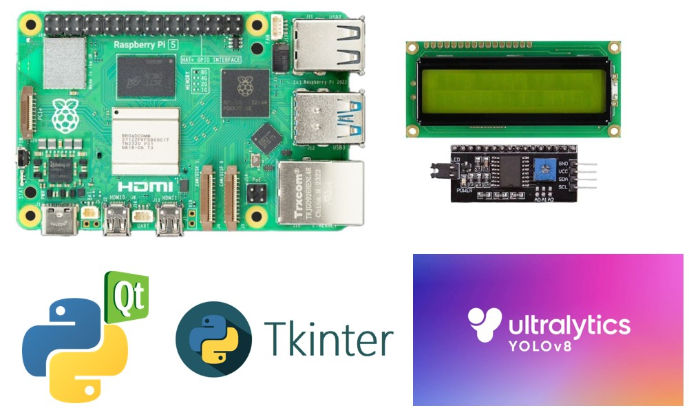

# Robotic Object Detection System - BSc. Thesis Final Project

<div align="center"> 
    
</div>

<div align="center"> 
    
</div>


**Author:** Mahya Kheirandish  
**Institution:** Urmia University  
**Department:** Electrical-Computer Engineering  
**Year:** 2025

## 📋 Project Overview

This project implements a real-time object detection and segmentation system using YOLOv8 (You Only Look Once version 8) with dual platform support - desktop application with PyQt5 GUI and Raspberry Pi implementation with LCD display support.

### 📄 Thesis Documentation
- **Full project report Document**: [Link to thesis PDF file](Final_Thesis_Project_Report(ENGLISH).pdf)

[Project Demo Video](./demo.mp4)

### Key Features

- **Real-time Object Detection**: Using YOLOv8 pre-trained models
- **Semantic Segmentation**: Advanced object boundary detection
- **Dual Platform Support**: Desktop (Windows/Linux) and Raspberry Pi
- **Interactive GUI**: User-friendly interfaces for both platforms
- **Selective Object Detection**: Filter specific objects or detect all
- **Hardware Integration**: LCD display support for Raspberry Pi
- **Live Video Processing**: Real-time camera feed processing

## 🛠️ Technical Stack

- **Deep Learning Framework**: YOLOv8 (Ultralytics)
- **Computer Vision**: OpenCV
- **GUI Frameworks**: PyQt5 (Desktop), Tkinter (Raspberry Pi)
- **Hardware**: Raspberry Pi with I2C LCD Display
- **Programming Language**: Python 3.7+
- **Additional Libraries**: NumPy, PIL, RPi.GPIO, RPLCD

## 🚀 Installation & Setup

### Desktop Application

1. Clone the repository:
```bash
git clone [repository-url]
cd BSc._Thesis_Final_Project
```

2. Install dependencies:
```bash
pip install -r python_scripts/desktop_requirements.txt
```

3. Run the desktop application:
```bash
python python_scripts/desktop_code.py
```

### Raspberry Pi Application

1. Install dependencies:
```bash
pip install -r python_scripts/raspberry_pi_requirements.txt
```

2. Connect LCD display via I2C (address 0x27)

3. Run the Raspberry Pi application:
```bash
python python_scripts/raspberry_pi_code.py
```

## 📁 Project Structure

```
BSc._Thesis_Final_Project/
├── python_scripts/
│   ├── desktop_code.py              # Desktop GUI application
│   ├── raspberry_pi_code.py         # Raspberry Pi application
│   ├── desktop_requirements.txt     # Desktop dependencies
│   └── raspberry_pi_requirements.txt # RPi dependencies
├── docs/
│   └── thesis.pdf                   # [Link to thesis document]
├── assets/
│   ├── urmia_logo.png              # University logo
│   └── demo_screenshots/           # Application screenshots
└── README.md
```

## 🎯 System Features

### Desktop Application
- PyQt5-based modern GUI
- Real-time video processing
- Object detection and segmentation modes
- Interactive object selection from available classes
- Visual feedback with bounding boxes and masks
- University branding integration

### Raspberry Pi Application
- Tkinter-based lightweight GUI
- Hardware-optimized performance
- I2C LCD display integration
- Object count display
- Multi-threaded video processing
- GPIO integration support

## 📊 Supported Object Classes

The system uses YOLOv8's pre-trained COCO dataset classes including:
- Person, Car, Truck, Bus, Motorcycle
- Chair, Table, Sofa, Bed
- Cat, Dog, Horse, Sheep, Cow
- And 75+ other object categories


## 🔧 Hardware Requirements

### Desktop System
- CPU: Intel i3 or equivalent
- RAM: 4GB minimum, 8GB recommended
- GPU: NVIDIA GTX 1050 or higher (optional, for better performance)
- Camera: USB webcam or built-in camera

### Raspberry Pi System
- Raspberry Pi 5 (4GB RAM recommended)
- Camera Module or USB camera
- 16x2 I2C LCD Display
- MicroSD card (32GB Class 10)
- Power supply (5V 3A)

## 📈 Performance Metrics

- **Detection Accuracy**: 85-95% (depending on object class)
- **Processing Speed**: 15-30 FPS (desktop), 5-10 FPS (RPi)
- **Memory Usage**: ~500MB (desktop), ~200MB (RPi)
- **Response Time**: <100ms for detection


## 📜 License

This project is part of academic research at Urmia University. All rights reserved.

## 🙏 Acknowledgments

- **Urmia University** - Computer Engineering Department
- **Thesis Supervisor** - [Supervisor Name]
- **Ultralytics Team** - For YOLOv8 framework
- **OpenCV Community** - For computer vision tools

---

**Note**: This project was developed as part of a Bachelor of Science thesis project in Electrical-Computer Engineering department of Urmia University, focusing on real-time object detection systems with practical hardware implementation for robotic applications.

